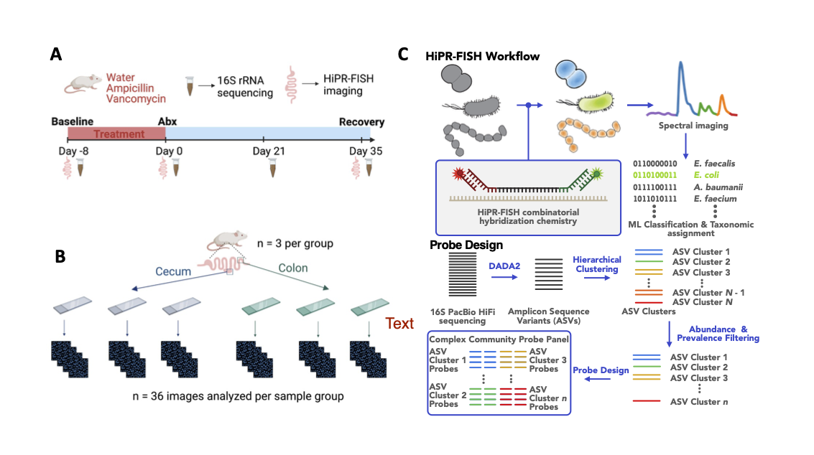

# mtag-Spatial_Abx_Manuscript

Code for the spatial analysis of the gut microbiota of mice before and after antibiotics exposure.

### To regenerate the neighborhood analysis:

Run the python scripts in `bin/`. Run them by first setting up bug_config.py according to the instructions within. Then run each python script in order: `count_bugs_1.py`, `search_nhoods_2corrected.py`, `plot_study_heatmap_3.py`. Or alternatively to run them all together use `run_all_files.py`

### To regenerate the figures in the spatial antibiotics manuscript:

Run the R scripts first to pre-process the data. Then run the corresponding Rmd file to regenerate the figures.
